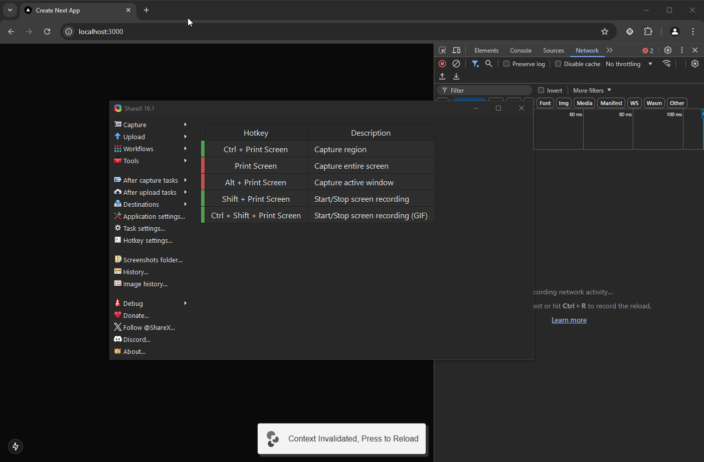

# Feature Flag Override Example

An example browser extension to simulate toggling client-side feature flags.

To work with manifest v3, this extension monkey patches the fetch function to intercept requests to the feature flag endpoint and override the response with the desired feature flag values.

## Running The Demo



### Browser Extension

#### Chrome

```cmd
cd BrowserExtension
yarn
yarn dev
```

In Chrome, go to [chrome://extensions/](chrome://extensions/), enable developer mode, click `Load unpacked`, then select the `build/chrome-mv3-dev` directory.

On installation, you may need to refresh the page if you already have the demo app open.

#### Firefox

```cmd
cd BrowserExtension
yarn
yarn build --target=firefox-mv2 --zip
```

In Firefox, go to [about:debugging#/runtime/this-firefox](about:debugging#/runtime/this-firefox), click `Load Temporary Add-on`, then select the `build/firefox-mv2-dev.zip` file.

### Demo App

```cmd
cd DemoApp
yarn
yarn dev
```

Open `http://localhost:3000` in your browser.
